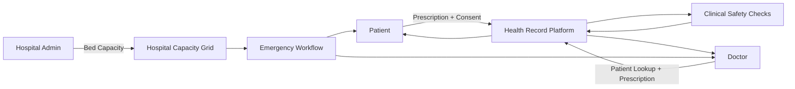

# Swasthya Setu

> A role-based digital health platform connecting patients, clinicians, and hospital operations through longitudinal health records, prescription digitization, clinical safety checks, and emergency capacity workflows.

**Live app:** https://health-setu-giaa.vercel.app

---

## Overview

Swasthya Setu is designed around three connected healthcare experiences:

* **Patient Health Vault** — a longitudinal record for prescriptions, medications, care plans, emergency information, and consent.
* **Doctor Clinical Workspace** — patient lookup, medication review, prescription creation, and clinical safety checks.
* **Hospital Capacity Grid** — live ICU, emergency, and general-bed visibility with emergency routing workflows.

The project emphasizes authenticated, role-specific access, persistent records, cross-device synchronization, and minimizing placeholder or pre-seeded patient data.

---

## Key Features

### 🧑‍⚕️ Patient Health Vault

* Patient-specific Unique IDs such as `HS-PAT-XXXX`
* Prescription image/PDF upload
* Multimodal prescription OCR using Google Gemini
* Deterministic fallback parsing when Gemini is unavailable
* Prescription verification before saving
* Longitudinal medication and clinical-record timeline
* Vernacular audio care-plan workflow
* Time-bound clinician/hospital consent

### 👨‍⚕️ Doctor Clinical Workspace

* Doctor-specific IDs such as `HS-DOC-XXXX`
* Patient lookup using a Unique ID
* Longitudinal record and medication review
* Digital prescription builder
* Drug-drug interaction (DDI) checks
* Allergy and cross-reactivity checks
* Duplicate-therapy checks
* Structured SBAR emergency handoff summaries
* Prescription synchronization back to the patient record

### 🏥 Hospital Capacity Grid

* Hospital-specific IDs such as `HS-HOSP-XXXX`
* ICU, emergency, and general-bed capacity tracking
* Bed states such as available, occupied, and cleaning
* Emergency facility discovery
* Capacity synchronization across connected workflows
* Emergency transfer and triage workflow concepts

---

## How the Roles Connect



### Typical patient-to-doctor flow

1. A patient creates or accesses their patient profile.
2. A prescription image or PDF is uploaded.
3. The OCR pipeline extracts medication information.
4. The patient reviews and confirms the extracted information.
5. The record is stored in the patient's longitudinal timeline.
6. The patient grants time-limited access to an authorized clinician.
7. The clinician reviews the patient's medication and allergy information.
8. New prescriptions pass through the documented safety checks.
9. The finalized prescription is synchronized to the patient record.

---

## Architecture

```text
┌───────────────────────────────────────────────────────────────┐
│                         FRONTEND                              │
│                                                               │
│ Patient Portal │ Doctor Workspace │ Hospital Capacity Grid    │
│ React + TypeScript + Vite                                     │
└──────────────────────────────┬────────────────────────────────┘
                               │ HTTPS / REST
                               ▼
┌───────────────────────────────────────────────────────────────┐
│                         BACKEND                               │
│                                                               │
│ FastAPI                                                       │
│ ├── Authentication & RBAC                                     │
│ ├── Clinical Records                                          │
│ ├── Prescription / Document Processing                        │
│ ├── Medication Normalization                                  │
│ ├── Clinical Safety Checks                                    │
│ └── Synchronization APIs                                      │
└──────────────────────────────┬────────────────────────────────┘
                               │
                               ▼
┌───────────────────────────────────────────────────────────────┐
│                       DATA LAYER                              │
│                                                               │
│ SQLAlchemy │ SQLite / PostgreSQL │ File Storage               │
│ Patient-scoped records and prescription documents             │
└───────────────────────────────────────────────────────────────┘

                         External Services
                               │
                  ┌────────────┴────────────┐
                  ▼                         ▼
             Google Gemini              Deployment
             Multimodal OCR          Vercel + Railway
```

---

## Tech Stack

### Frontend

* React 19
* TypeScript 5.8
* Vite 6
* Vanilla CSS / Tailwind CSS
* Lucide React
* Radix UI
* Lenis

### Backend

* Python 3.12+
* FastAPI
* Uvicorn
* Pydantic v2
* SQLAlchemy 2.x
* SQLite / PostgreSQL
* Argon2id password hashing
* JWT authentication
* Google Gemini multimodal API

### Deployment

* **Frontend:** Vercel
* **Backend:** Railway

---

## Project Structure

```text
Swasthya-Setu/
├── frontend/
│   ├── src/
│   │   ├── components/
│   │   │   ├── auth/
│   │   │   ├── common/
│   │   │   ├── doctor/
│   │   │   ├── hospital/
│   │   │   ├── landing/
│   │   │   └── patient/
│   │   ├── services/
│   │   ├── types/
│   │   └── App.tsx
│   ├── package.json
│   └── vite.config.ts
│
├── app/
│   ├── api/v1/endpoints/
│   │   ├── auth.py
│   │   ├── clinical_records.py
│   │   ├── documents.py
│   │   ├── medications.py
│   │   └── safety.py
│   ├── core/
│   │   ├── config.py
│   │   ├── security.py
│   │   └── database.py
│   └── main.py
│
├── scripts/
│   ├── verify_integration.py
│   └── verify_backend_e2e.py
│
├── Dockerfile
├── railway.json
├── vercel.json
├── requirements.txt
└── README.md
```

---

## Quick Start

### Prerequisites

* Node.js 18+
* npm 9+
* Python 3.12+
* Optional: Google Gemini API key for multimodal prescription OCR

### 1. Clone

```bash
git clone https://github.com/janasayan-cmd/Swasthya-Setu.git
cd Swasthya-Setu
```

### 2. Frontend

```bash
cd frontend
npm install
npm run dev
```

Frontend development server:

```text
http://localhost:5173
```

### 3. Backend

From the project root:

```bash
python -m venv venv
```

Windows:

```powershell
.\venv\Scripts\Activate.ps1
```

macOS/Linux:

```bash
source venv/bin/activate
```

Install dependencies:

```bash
pip install -r requirements.txt
```

Start the API:

```bash
uvicorn app.main:app --host 127.0.0.1 --port 8000 --reload
```

Backend:

```text
http://127.0.0.1:8000
```

Swagger/OpenAPI:

```text
http://127.0.0.1:8000/docs
```

---

## Environment Variables

Create a `.env` file in the project root.

```env
HOST=127.0.0.1
PORT=8000
ENVIRONMENT=development

# Generate your own strong secret. Never commit real secrets.
SECRET_KEY=replace-with-a-long-random-secret
JWT_ALGORITHM=HS256
ACCESS_TOKEN_EXPIRE_MINUTES=60

# Optional: enables Gemini-powered prescription OCR
GEMINI_API_KEY=your_gemini_api_key

# Frontend API target
VITE_API_BASE_URL=http://127.0.0.1:8000
```

**Never commit API keys, JWT secrets, passwords, or production credentials to Git.**

---

## Verification

The repository documents automated checks for integration, backend behavior, and frontend builds.

### Integration verification

```bash
python scripts/verify_integration.py
```

### Backend verification

```bash
python scripts/verify_backend_e2e.py
```

### Frontend production build

```bash
cd frontend
npm run build
```

The original project documentation reports verification coverage for:

* Unique ID generation
* Empty/new-account state
* Multi-device synchronization
* Role-based access boundaries
* Clinical safety scenarios
* Production frontend compilation

Actual verification results should be confirmed by running the current test/build commands against the current codebase.

---

## Security & Privacy

Swasthya Setu is designed with several security-oriented principles:

* Role-based access boundaries
* Patient-scoped records
* Password hashing with Argon2id
* JWT-based authentication
* Time-bound consent workflows
* Authenticated API access
* No intentionally pre-seeded patient records in new profiles
* Separation of patient, clinician, and hospital workflows

> **Important:** This repository's README describes application architecture and intended behavior. It should not be interpreted as a guarantee of regulatory certification, clinical safety, or production security without independent validation, testing, and compliance review.

---

## Clinical Safety Notice

Swasthya Setu includes software workflows for medication and allergy checks. These features are intended as **decision-support functionality**, not as a replacement for qualified medical judgment.

Medication decisions, diagnoses, emergency triage, and treatment changes should be verified by appropriately qualified healthcare professionals.

---

## Standards & Interoperability

The project documentation describes data models and workflows inspired by **ABDM** and **FHIR R4** concepts.

Standards compatibility or compliance should be independently validated against the applicable specifications and deployment requirements before making a formal compliance claim.

---

## Deployment

The documented deployment architecture uses:

```text
Frontend  → Vercel
Backend   → Railway
```

The live frontend documented by the project is:

https://health-setu-giaa.vercel.app

For production deployment, configure environment variables and secrets through the hosting provider rather than committing them to the repository.

---

## Contributing

1. Fork the repository.
2. Create a feature branch.

```bash
git checkout -b feature/your-feature
```

3. Make and test your changes.
4. Commit them.

```bash
git add .
git commit -m "Add your feature"
```

5. Push the branch.

```bash
git push origin feature/your-feature
```

6. Open a pull request.

---

## License

This project is distributed under the **MIT License**. See [`LICENSE`](LICENSE) for details.

---

<div align="center">

**Swasthya Setu**

Digital health infrastructure for connected patient, clinical, and hospital workflows.

</div>
