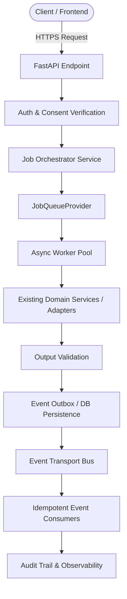

# Phase 22 — Asynchronous Workflow & Event-Driven Architecture

## 1. System Architecture Overview

The HealthSetu asynchronous execution layer offloads computationally intensive, long-running, and third-party-dependent operations outside of synchronous HTTP request-response cycles.

## 2. Core Architectural Invariants

1. **Async Execution $\neq$ Clinical Authority**:
   - Background tasks and asynchronous events execute domain actions, but **never make autonomous clinical decisions**.
   - Workers cannot autonomously prescribe medications, modify dosages, confirm unverified diagnoses, or bypass consent boundaries.
2. **Authorize-BEFORE-Enqueue**:
   - Access control, JWT subject verification, and patient consent evaluation happen synchronously before any job is created or enqueued.
3. **Zero PHI in Queue Payloads**:
   - Queue messages contain only metadata references (`job_id`, `patient_id`, `resource_id`, `operation_type`). Unmasked clinical records are never passed over message buses.
4. **Outbox Reliable Publishing**:
   - Domain state changes and outbound event records are committed transactionally to ensure at-least-once delivery without phantom events.

## 3. Technology Abstraction Layer

- **Job Queue Interface**: [`JobQueueProvider`](file:///c:/Users/SAYAN/OneDrive/Desktop/HealthSetu/app/integrations/queue/base.py) decouples orchestration from the underlying broker (`InMemoryJobQueueProvider`, Redis, AWS SQS, or RabbitMQ).
- **Event Bus Interface**: [`EventTransport`](file:///c:/Users/SAYAN/OneDrive/Desktop/HealthSetu/app/integrations/events/base.py) decouples event publishing/subscription from messaging infrastructure (`InMemoryEventTransport`, Kafka, AWS SNS).
- **Worker Execution Loop**: [`AsyncWorkerPool`](file:///c:/Users/SAYAN/OneDrive/Desktop/HealthSetu/app/workers/worker.py) enforces bounded concurrency slots (`WORKER_CONCURRENCY=5`) and bounded task timeouts.
