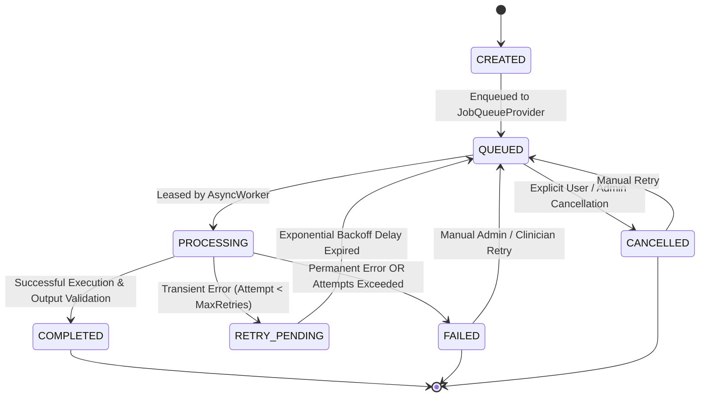

# Phase 22 — Asynchronous Job Lifecycle & State Transitions

## 1. State Machine

All asynchronous jobs strictly adhere to the following deterministic state transitions:

## 2. Transition Invariants

- **No `FAILED` $\rightarrow$ `COMPLETED` transitions**: A failed job cannot be marked completed without re-entering the queue and executing through the domain worker loop.
- **Terminal States**: `COMPLETED`, `FAILED`, and `CANCELLED` are terminal. `is_terminal=True` is set upon transition.
- **Safe Replay**: An existing job queried with a recognized `idempotency_key` returns the cached `COMPLETED` result payload directly without side effects.

## 3. Transient vs. Permanent Error Classification

| Error Type | Classification | Action |
| :--- | :--- | :--- |
| Upstream 502/503/504 | Transient | Backoff retry (`RETRY_PENDING` $\rightarrow$ `QUEUED`) |
| Provider Connection Timeout | Transient | Backoff retry with randomized jitter |
| Missing / Revoked Patient Consent | Permanent | Immediate `FAILED` transition; audit recorded |
| Schema / Field Validation Error | Permanent | Immediate `FAILED` transition; dead-letter logged |
| Unsupported Document MIME Type | Permanent | Immediate `FAILED` transition |
| Medication Safety Provider Outage | Managed Clinical Fallback | Status marked `UNKNOWN` / `ERROR`, manual pharmacist review mandatory |
