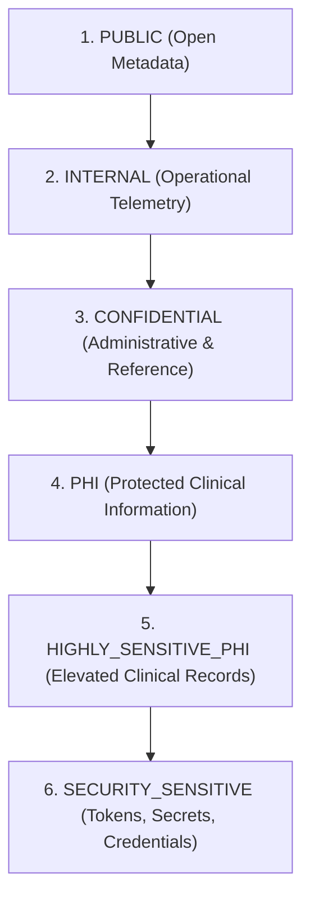

# HealthSetu — Data Classification & PHI Categorization Framework (Phase 24)

## 1. Classification Hierarchy

HealthSetu defines a 6-tier conceptual data classification hierarchy implemented in `app/core/privacy.py`:

---

## 2. Resource Classification Mapping

| Classification | Conceptual Definition | Representative HealthSetu Resources | Governance Rules |
| :--- | :--- | :--- | :--- |
| **PUBLIC** | Information freely shareable without risk. | API documentation, OpenAPI schema, public privacy policy text, public health bulletins. | No authentication required. Cached aggressively. |
| **INTERNAL** | System operational data containing zero PHI. | Prometheus metrics, system health probes, organization & facility directories, synthetic test fixtures. | Internal network or authenticated access. Scrubbed of identifiers. |
| **CONFIDENTIAL** | Proprietary or administrative data without direct clinical content. | Clinician profiles, billing summaries, retention policy rules, audit metadata headers. | Role-gated. Strictly restricted to administrative and operational personnel. |
| **PHI** | Protected Health Information identifying an individual's care, treatment, or clinical history. | Patient profile, vital signs, encounters, prescriptions, medications, triage assessments, care plans, discharge summaries. | Requires authentication + patient identity match OR clinician active consent/relationship + explicit purpose. |
| **HIGHLY_SENSITIVE_PHI** | Clinical records carrying elevated stigma, discrimination risk, or strict statutory privacy. | Clinical progress notes, psychiatric assessments, allergy records, genetic test findings, substance abuse evaluations, AI summaries. | Elevated audit logging. Prohibited from general system administrator view. Strict clinician purpose verification. |
| **SECURITY_SENSITIVE** | Critical credentials, secret keys, and cryptographic material. | Argon2id password hashes, JWT signing keys, refresh tokens, API keys, database connection strings, pseudonymization salt. | Never exposed via API. Excluded from all logs, metrics, exports, and traces. Hard-coded redaction filters. |

---

## 3. Purpose Limitation Framework

Processing of PHI and Highly Sensitive PHI requires an explicit, validated `DataProcessingPurpose`:

1. `CLINICAL_CARE`: Immediate direct patient diagnosis, treatment, and consultation.
2. `DOCUMENT_PROCESSING`: Ingestion, virus scanning, and OCR extraction of uploaded records.
3. `MEDICATION_SAFETY`: Automated drug-drug and drug-allergy contraindication checks.
4. `TRIAGE`: Urgent and emergency clinical acuity assessment.
5. `CARE_PLAN`: Post-discharge and chronic disease management planning.
6. `INTEROPERABILITY`: ABDM and FHIR R4 clinical data exchange.
7. `CLINICAL_REVIEW`: Peer review, quality assurance, and clinical verification.
8. `PATIENT_DATA_EXPORT`: Patient-directed or clinician-assisted full health record bundle compilation.
9. `SECURITY`: Intrusion detection, access audit, and abuse prevention.
10. `AUDIT`: Formal regulatory and administrative compliance verification.
11. `SYSTEM_OPERATIONS`: Bounded background maintenance, indexing, and health checks.

> [!IMPORTANT]
> Unmapped resources or unrecognized request purposes **FAIL CLOSED** and are automatically treated as `HIGHLY_SENSITIVE_PHI`, rejecting the request.
