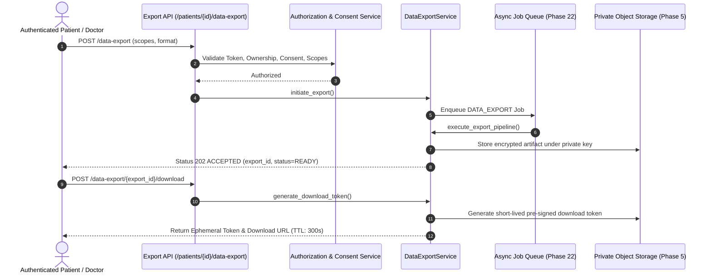

# HealthSetu — Controlled Patient Data Export Architecture (Phase 24)

## 1. Overview

The Patient Data Export framework (`app/services/data_export_service.py`) provides an asynchronous, privacy-preserving mechanism for patients and authorized clinicians to compile structured longitudinal medical records.

---

## 2. Supported Export Scopes (Data Minimization)

Requests must specify explicit scopes; broad unconstrained dumping is prevented:

1. `PATIENT_PROFILE`: Demographics, biological sex, contact info.
2. `CLINICAL_HISTORY`: Medical conditions, chronic illness history.
3. `ENCOUNTERS`: Historical consultation dates, facilities, providers.
4. `ALLERGIES`: Known allergen substances, reaction severities.
5. `VITALS`: Recorded blood pressure, pulse, temperature, oxygen saturation.
6. `MEDICATIONS`: Current and past active medication regimens.
7. `PRESCRIPTIONS`: Formal prescription orders and instructions.
8. `DOCUMENTS`: Metadata references and verified extractions of medical files.
9. `TRIAGE`: Acuity evaluations and emergency symptom intakes.
10. `CARE_PLANS`: Active goals, assigned clinicians, and interventions.
11. `TRANSFERS`: Inter-facility transfer records and handoff summaries.
12. `INTEROPERABILITY_DATA`: External exchanged records.
13. `FULL_AUTHORIZED_RECORD`: Complete authorized clinical bundle.

---

## 3. Supported Serialization Formats

- **JSON**: Hierarchical structured bundle matching HealthSetu domain contracts.
- **CSV**: Multi-section tabular CSV suitable for structured analysis and patient spreadsheets.
- **FHIR**: Standard FHIR R4 Bundle resource (type: `collection`) with embedded `Patient` and clinical entries, aligning with Phase 13 interoperability standards.

---

## 4. Security & Ephemeral Access Controls

- **Private Storage**: Export files are saved under non-guessable paths (`exports/{patient_id}/{export_id}.{format}`) in private object storage.
- **Short-Lived Download Credentials**: Download endpoints issue ephemeral signed tokens expiring within 300 seconds. No permanent public URLs are ever created.
- **Artifact Expiration**: Export files expire after 24 hours (`EXPORT_EXPIRATION_SECONDS = 86400`) and are purged automatically by background workers.
