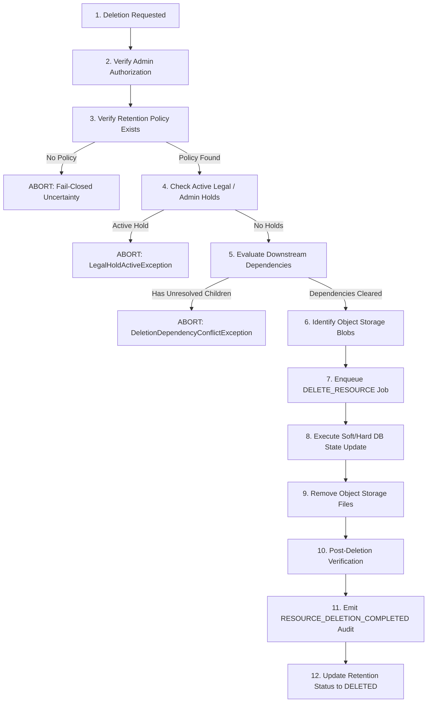

# HealthSetu — Controlled Resource Deletion & Dependency Architecture (Phase 24)

## 1. Overview & Deletion Invariant

Destructive data deletion is a strictly governed, multi-stage workflow. Immediate synchronous purging of healthcare records from standard API handlers is prohibited.

> [!IMPORTANT]
> **THE UNCERTAINTY INVARIANT (TRD Sec 15, 37, 47):**
> If a retention policy is undefined, or hold status cannot be verified, or dependency integrity is uncertain:
> **THE SYSTEM MUST FAIL CLOSED AND REFUSE DELETION.**

---

## 2. 12-Step Deletion Flow

---

## 3. Dependency Verification

Before a patient or parent entity can be deleted, the backend checks downstream domain records:
- Medical documents & uploaded binary blobs
- Prescriptions & medication entries
- Encounters & consultation notes
- Triage assessments & SBAR logs
- Care plans & active tasks
- Interoperability exchange records

If active dependent records exist and the deletion request does not specify explicit cascading authorization, the operation raises `DeletionDependencyConflictException` (HTTP 409).

---

## 4. Disaster Recovery & Backup Interaction (TRD Sec 38, 39)

> [!CAUTION]
> **DATA DELETION ≠ IMMEDIATE ERASURE FROM BACKUPS**
> Deletion at the application and database layer marks records as `DELETED` and purges live object storage files. However, pre-existing database snapshot backups and storage replication mirrors retain historical states until their separate infrastructure lifecycle expires (e.g. 30-day WAL retention).
> When restoring a database from backup, the restoration verification process cross-references the immutable audit trail and deletion markers to ensure deleted patient records are not accidentally resurrected into an active clinical state.
