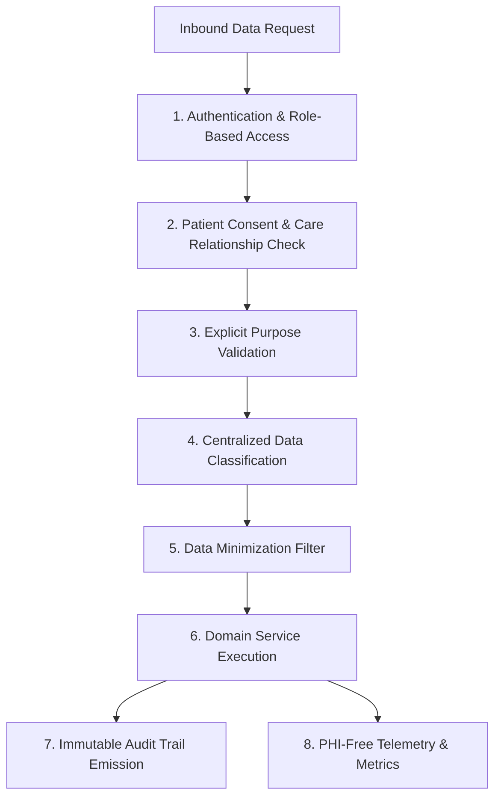

# HealthSetu — Advanced Data Privacy & Data Governance Architecture (Phase 24)

## 1. Executive Summary & Legal Boundary

Phase 24 establishes the backend data-governance and privacy-control layer across HealthSetu. It governs sensitive healthcare data across its complete lifecycle: from creation, storage, purpose-aware processing, and minimization, through to retention, archival, controlled deletion, and patient-authorized export.

> [!CAUTION]
> **CRITICAL LEGAL & REGULATORY DISCLAIMER (TRD Sec 1, 51, 54):**
> Implementation of this technical privacy framework **DOES NOT** claim or confer legal compliance, statutory certification (e.g., HIPAA, GDPR, DISHA, or ABDM certification), or legal interpretation by itself. 
> Actual retention durations, statutory hold policies, disclosure rights, and jurisdictional data residency requirements must be determined and governed by qualified institutional legal counsel and formal organizational policies.

---

## 2. Core Privacy Invariants

HealthSetu privacy operations are governed by eight non-negotiable architectural principles:

1. **Data Minimization**: Collect and transmit only the minimal subset of attributes necessary for an authorized operation.
2. **Purpose Limitation**: Generic "system access" does not authorize clinical inspection. All access must specify an authorized `DataProcessingPurpose`.
3. **Fail-Closed Privacy**: If a retention policy is undefined, or consent cannot be verified, or an access purpose is ambiguous, the system **FAILS CLOSED** (denies access and refuses deletion).
4. **Least Privilege & Role Boundaries**: Administrators have governance capabilities (holds, policy management, cleanup triggers) but are strictly forbidden from viewing raw clinical notes or patient care plans under routine operations.
5. **Traceability & Auditability**: Every privacy check, export request, download, hold placement, and deletion emits immutable structured audit events.
6. **Provenance & Lineage**: Data transformations (OCR extraction, normalization, FHIR mapping, AI assistance) retain explicit lineage tracking distinguishing source, transformation, verification, and current state.
7. **Safe Deletion**: Deletion is a multi-step orchestrated workflow that verifies retention policies, active preservation holds, and clinical dependencies before proceeding.
8. **Backup Interaction**: Application-level deletion terminates live operational access and object storage, but operational backups retain snapshots governed by separate infrastructure retention cycles.

---

## 3. Subsystem Architectural Components

| Component | Module Path | Core Purpose |
| :--- | :--- | :--- |
| **Privacy Core** | `app/core/privacy.py` | Data classifications, processing purposes, PHI masking, telemetry sanitization, error response safety. |
| **Privacy Policy Service** | `app/services/privacy_service.py` | Access evaluation across role, consent, and purpose; lineage tracking; audit emission. |
| **Retention Service** | `app/services/retention_service.py` | Configurable retention policies, preservation holds, archival transitions, and fail-closed deletion. |
| **Data Export Service** | `app/services/data_export_service.py` | Multi-repository patient bundle assembly, scope minimization, ephemeral download token generation. |
| **De-identification Service**| `app/services/deidentification_service.py` | Text redaction, date shifting, and demographic generalization for non-production environments. |
| **Pseudonymization Service**| `app/services/pseudonymization_service.py` | Cryptographically salted HMAC-SHA256 identifier tokenization with protected reverse index. |
| **Privacy Workers** | `app/workers/tasks/` | Asynchronous processing for export assembly, expired artifact purging, and batch transformations. |
