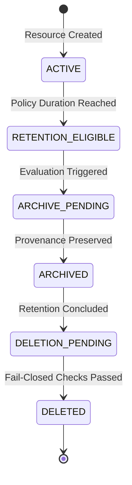

# HealthSetu — Data Retention & Lifecycle Management (Phase 24)

## 1. Architectural Intent

HealthSetu implements configurable retention orchestration without hard-coding statutory or legal retention durations. Retention rules are decoupled from domain logic and configured through structured `RetentionPolicy` models in `app/services/retention_service.py`.

---

## 2. Configurable Policy Baseline

| Resource Type | Configurable Period | Trigger Event | Post-Period Action | Mode |
| :--- | :--- | :--- | :--- | :--- |
| `medical_document` | 3,650 days (10 yrs default) | Document Creation | Archival | Soft-delete after archive period |
| `document_extraction` | 3,650 days | Extraction Completion | Archival | Soft-delete tied to parent doc |
| `patient_data_export` | 1 day (24 hours) | Export Generation | None | Permanent deletion of artifact |
| `triage_assessment` | 1,825 days (5 yrs default) | Assessment Finalization | Archival | Soft-delete |
| `care_plan` | 1,825 days | Care Plan Discharge | Archival | Soft-delete |
| `audit_record` | 2,555 days (7 yrs default) | Event Timestamp | Archival | Restricted / Immutable |
| `temporary_file` | 1 day | Creation | None | Permanent purge |

---

## 3. Legal & Organizational Preservation Holds

Preservation holds strictly supersede and freeze normal retention lifecycles:

- **Supported Hold Types**:
  - `LEGAL_HOLD`: Active litigation, subpoena, or discovery order.
  - `INVESTIGATION_HOLD`: Internal medical board or clinical incident investigation.
  - `ORGANIZATIONAL_RETENTION_HOLD`: Administrative or institutional policy review.
  - `CLINICAL_RECORD_HOLD`: Longitudinal patient treatment dependency.
- **Rule of Enforcement**:
  - A resource with one or more active holds **CANNOT BE DELETED**, even if requested by an administrator with `force=True`.
  - Holds can only be placed and released by authorized administrative personnel with full audit logging.
