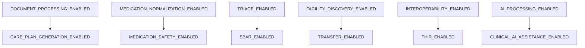

# HealthSetu — Phase 25: Feature Flag Governance & Specification

## 1. Feature Flag Canonical Model

Every feature flag in HealthSetu is tracked with rich metadata, explicit ownership, and safe default states:

| Field | Type | Description |
|---|---|---|
| `name` | string | Canonical feature name (e.g. `MEDICATION_SAFETY_ENABLED`) |
| `description` | string | Clinical or operational purpose of the feature |
| `category` | enum | Configuration category (e.g. `MEDICATION_SAFETY`) |
| `state` | enum | `ENABLED`, `DISABLED`, `PERCENTAGE_ROLLOUT`, `ALLOWLIST`, `ORGANIZATION_ROLLOUT`, `ENVIRONMENT_ONLY` |
| `lifecycle` | enum | `PROPOSED`, `CREATED`, `TESTING`, `STAGING`, `ROLLOUT`, `ACTIVE`, `DEPRECATED`, `REMOVED` |
| `default_enabled` | boolean | Safe programmatic fallback if runtime lookup is absent |
| `dependencies` | list[str] | Prerequisite flags that must evaluate to `True` |
| `percentage` | int (0-100) | Allocation bucket for percentage rollouts |
| `allowlist_users` | list[str] | Allowlisted user IDs |
| `allowlist_organizations` | list[str] | Allowlisted hospital / clinic organization IDs |
| `allowlist_facilities` | list[str] | Allowlisted physical facility IDs |
| `environments` | list[str] | Active deployment environments |

---

## 2. Canonical Feature Flags (TRD Sec 17)

1. `DOCUMENT_PROCESSING_ENABLED`: Document OCR and text extraction workflows.
2. `MEDICATION_NORMALIZATION_ENABLED`: Drug naming and code standardization.
3. `MEDICATION_SAFETY_ENABLED`: Clinical drug-drug and drug-allergy contraindication checks (Depends on `MEDICATION_NORMALIZATION_ENABLED`).
4. `TRIAGE_ENABLED`: Emergency symptom assessment and acuity classification.
5. `SBAR_ENABLED`: Clinical handoff communication note generation (Depends on `TRIAGE_ENABLED`).
6. `CARE_PLAN_GENERATION_ENABLED`: Discharge care plan structuring (Depends on `DOCUMENT_PROCESSING_ENABLED`).
7. `CLINICAL_WORKSPACE_ENABLED`: Doctor assessments, clinical notes, and signing.
8. `FACILITY_DISCOVERY_ENABLED`: Geo-spatial healthcare provider discovery.
9. `TRANSFER_ENABLED`: Patient inter-facility transfer requests (Depends on `FACILITY_DISCOVERY_ENABLED`).
10. `INTEROPERABILITY_ENABLED`: External FHIR/HL7 connectivity.
11. `FHIR_ENABLED`: FHIR R4 mapping and ingestion (Depends on `INTEROPERABILITY_ENABLED`).
12. `AI_PROCESSING_ENABLED`: Foundational generative AI copilot services.
13. `CLINICAL_AI_ASSISTANCE_ENABLED`: Doctor-facing reasoning and summarization (Depends on `AI_PROCESSING_ENABLED`).
14. `ASYNC_PROCESSING_ENABLED`: Background task queuing and asynchronous event buses.
15. `DATA_EXPORT_ENABLED`: Patient-driven and administrative data export pipelines.

---

## 3. Dependency Validation & Cascading Shutdown

Feature flags declare hard prerequisites. If a parent flag is disabled, all dependent child flags automatically evaluate to `False` without throwing unexpected exceptions:

---

## 4. Evaluation Strategy & In-Memory Caching

- `is_enabled(flag_name, context)` performs constant-time in-memory lookups.
- Results are cached with a bounded TTL (`CONFIG_CACHE_TTL_SECONDS=60`).
- Administrative changes immediately invoke `invalidate_cache()` across the service instance.
